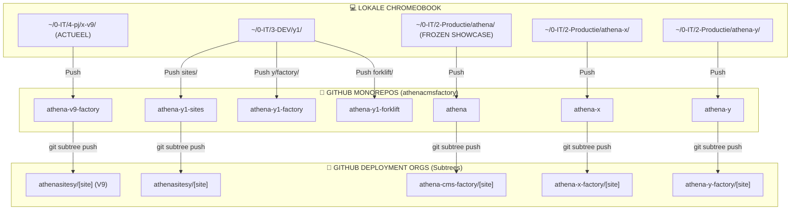

# 🏗️ Athena CMS Factory: Repository Architectuur

Dit document beschrijft de structurele verbondenheid tussen de lokale ontwikkelomgeving op de Chromebook en de GitHub-infrastructuren.

---

## 🎨 Visueel Overzicht (Architectuur)



---

## 📋 Gedetailleerde Verbindingsmatrix

### 1. Generatie Athena V9 (ACTUEEL)
| Lokaal Pad | GitHub Monorepo | Deployment Org |
|:---|:---|:---|
| `~/0-IT/4-pj/x-v9/` | `athenacmsfactory/athena-v9-factory` | `athenasitesy/` |

### 2. Generatie Y1 (Modern / DEV)
| Lokaal Pad | GitHub Monorepo | Deployment Org |
|:---|:---|:---|
| `~/0-IT/3-DEV/y1/sites` | `athenacmsfactory/athena-y1-sites` | `athenasitesy/` |
| `~/0-IT/3-DEV/y1/y/factory` | `athenacmsfactory/athena-y1-factory` | *(Engine Only)* |
| `~/0-IT/3-DEV/y1/forklift` | `athenacmsfactory/athena-y1-forklift` | *(Tools Only)* |

### 3. Generatie Athena (V1 / BEVROREN SHOWCASE)
| Lokaal Pad | GitHub Monorepo | Deployment Org |
|:---|:---|:---|
| `~/0-IT/2-Productie/athena` | `athenacmsfactory/athena` | `athena-cms-factory/` |

### 4. Generatie Athena-X (Experimenteel)
| Lokaal Pad | GitHub Monorepo | Deployment Org |
|:---|:---|:---|
| `~/0-IT/2-Productie/athena-x` | `athenacmsfactory/athena-x` | `athena-x-factory/` |

### 5. Generatie Athena-Y (Vroegere Productie)
| Lokaal Pad | GitHub Monorepo | Deployment Org |
|:---|:---|:---|
| `~/0-IT/2-Productie/athena-y` | `athenacmsfactory/athena-y` | `athena-y-factory/` |

---

## 🛠️ Gebruikte Technieken & Commando's

### 📡 SSH Identiteit
De factory gebruikt een gespecialiseerde SSH host (`github-athena`) om toegang te krijgen tot de repositories van de Athena organisatie.
*   **Host:** `github-athena`
*   **User:** `git`
*   **IdentityFile:** Wordt beheerd in `~/.ssh/config`

### 🌿 Git Subtree Workflow
Voor het pushen van individuele sites vanuit de monorepo naar hun eigen repositories wordt het volgende patroon gebruikt:
```bash
git subtree push --prefix sites/[site-name] git@github.com:[org]/[site-repo].git main
```

---

## 🚀 Toekomst & Automatisering (KDClaw)
KDClaw is geconfigureerd om deze paden te herkennen en kan de volgende taken automatiseren:
1.  **Backup**: Automatisch backups maken van de monorepo's naar `0-IT/4-BACKUP/`.
2.  **Sync**: Het pushen van wijzigingen naar de monorepo's en subtrees in één commando.
3.  **Audit**: Controleren of de lokale staat nog matcht met de GitHub status.

*Gegenereerd door KDClaw voor Strategische Re-integratie.*
